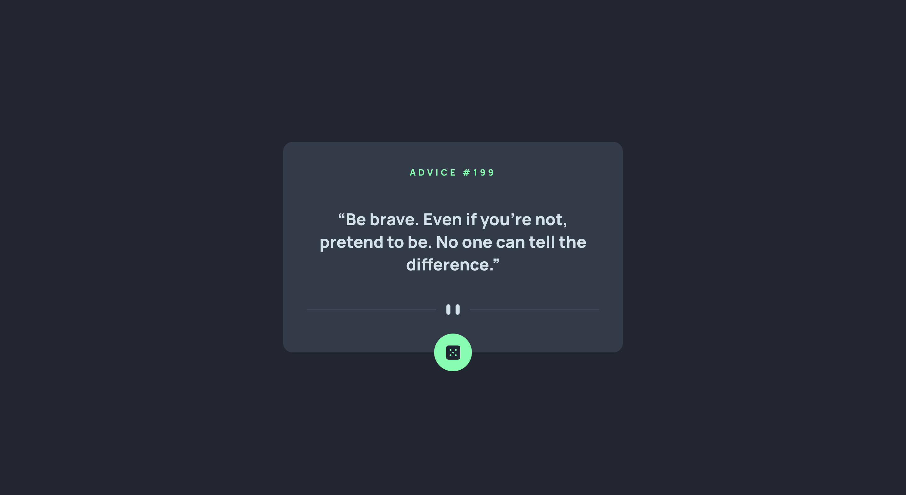

# 🚀 Advice Generator App

This is a solution to the [Advice Generator App challenge on Frontend Mentor](https://www.frontendmentor.io/challenges/advice-generator-app-QdUG-13db). Frontend Mentor challenges help you improve your coding skills by building realistic projects.

--- 

## ✅ Table of contents

- [Overview](#-overview)
    - [The challenge](#the-challenge)
    - [Screenshots](#screenshots)
    - [Links](#links)
- [My process](#-my-process)
    - [Built with](#built-with)
    - [What I learned](#what-i-learned)
    - [Useful resources](#useful-resources)
- [Author](#-author)

---

## 💡 Overview

### The challenge

Users should be able to:

- View the optimal layout for the app depending on their device's screen size
- See hover states for all interactive elements on the page
- Generate a new piece of advice by clicking the dice icon

### Screenshots

 
  
  <em>advice generator app</em>

### Links

- Solution URL: [GitHub](https://github.com/jakubjirous/advice-generator-app/)
- Live Site URL: [Vercel](https://advice-generator-app-jakubjirous.vercel.app/)

---

## 🎯 My process

### Built with

- Semantic HTML5 markup
- CSS custom properties
- Flexbox
- CSS Grid 
- Mobile-first workflow
- [Next.js](https://nextjs.org/) – React framework
- [React](https://reactjs.org/) – JS library
- [TanStack Query (FKA React Query)](https://tanstack.com/query/latest) – Data fetching library
- [Chakra UI](https://chakra-ui.com/) – For styles

### What I learned

In this Code Challenge, I expanded my knowledge of web development by incorporating the Tanstack React Query fetching library with Next.js (v13) to create an advice generator app. 

This project allowed me to develop practical skills in creating responsive and dynamic user interfaces using the latest technologies.

### Useful resources

- [Next.js Documentation](https://beta.nextjs.org/docs)
- [React Documentation](https://beta.reactjs.org/)
- [TanStack Query Documentation](https://tanstack.com/query/latest/docs/react/overview)
- [Chakra UI Documentation](https://chakra-ui.com/getting-started)

---

## 👨‍💻 Author

- Website – [www.jakubjirous.cz](https://www.jakubjirous.cz)
- Frontend Mentor – [@jakubjirous](https://www.frontendmentor.io/profile/jakubjirous)
- LinkedIn – [jakubjirous](https://www.linkedin.com/in/jakubjirous/)
