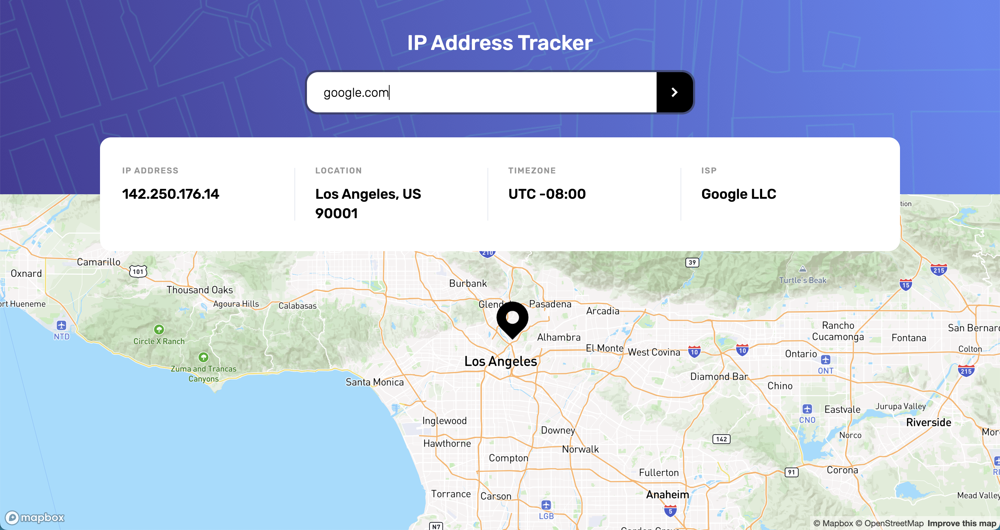
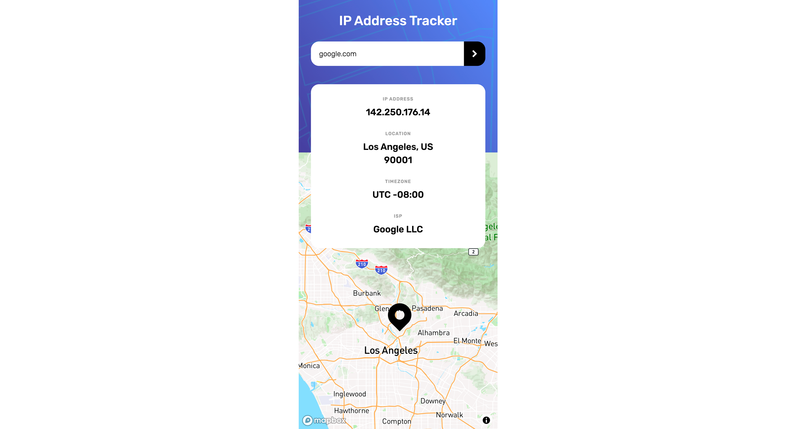

# 🚀 IP Address Tracker

This is a solution to the [IP Address Tracker challenge on Frontend Mentor](https://www.frontendmentor.io/challenges/ip-address-tracker-I8-0yYAH0). Frontend Mentor challenges help you improve your coding skills by building realistic projects.

--- 

## ✅ Table of contents

- [Overview](#-overview)
    - [The challenge](#the-challenge)
    - [Screenshots](#screenshots)
    - [Links](#links)
- [My process](#-my-process)
    - [Built with](#built-with)
    - [What I learned](#what-i-learned)
    - [Useful resources](#useful-resources)
- [Author](#-author)

---

## 💡 Overview

### The challenge

Users should be able to:

- View the optimal layout for each page depending on their device's screen size
- See hover states for all interactive elements on the page
- See their own IP address on the map on the initial page load
- Search for any IP addresses or domains and see the key information and location

### Screenshots

 
  
  <em>desktop version</em>

 
  
  <em>mobile version</em>

### Links

- Solution URL: [GitHub](https://github.com/jakubjirous/ip-address-tracker/)
- Live Site URL: [Vercel](https://ip-address-tracker-jakubjirous.vercel.app/)

---

## 🎯 My process

### Built with

- Semantic HTML5 markup
- CSS custom properties
- Flexbox
- CSS Grid 
- Mobile-first workflow
- [Next.js](https://nextjs.org/) – React framework
- [React](https://reactjs.org/) – JS library
- [TanStack Query (FKA React Query)](https://tanstack.com/query/latest) – Data fetching library
- [Axios](https://axios-http.com/) - HTTP client
- [Tailwind CSS](https://tailwindcss.com/) – For styles
- [React Hook Form](https://react-hook-form.com/) - For form state management

### What I learned

This challenge was very interesting for me. It gave me the opportunity to deepen my knowledge of Tanstack query v4 so that I can fetch data from external APIs in a more powerful way, especially by using the useQuery hooks together with the useIsFetching hook.

Also, this was the first time that I had used Tailwind CSS to implement a design, and I had also integrated Mapbox to enable the display of custom markers on online maps in precise coordinates, which is what makes this site unique.

### Useful resources

- [Next.js Documentation](https://beta.nextjs.org/docs)
- [React Documentation](https://beta.reactjs.org/)
- [TanStack Query Documentation](https://tanstack.com/query/latest/docs/react/overview)
- [Tailwind CSS Documentation](https://tailwindcss.com/docs/installation)
  - [Quick reference](https://tailwindcss.com/docs/hover-focus-and-other-states#quick-reference) 
  - [Customizing Screens](https://tailwindcss.com/docs/screens)
  - [Functions & Directives](https://tailwindcss.com/docs/functions-and-directives)
  - [Default configuration](https://github.com/tailwindlabs/tailwindcss/blob/master/stubs/defaultConfig.stub.js)
  - [Default spacing scale](https://tailwindcss.com/docs/customizing-spacing#default-spacing-scale)
- [React Hook Form Documentation](https://react-hook-form.com/get-started)
- [Heroicons](https://heroicons.com/)

---

## 👨‍💻 Author

- Website – [www.jakubjirous.cz](https://www.jakubjirous.cz)
- Frontend Mentor – [@jakubjirous](https://www.frontendmentor.io/profile/jakubjirous)
- LinkedIn – [jakubjirous](https://www.linkedin.com/in/jakubjirous/)
